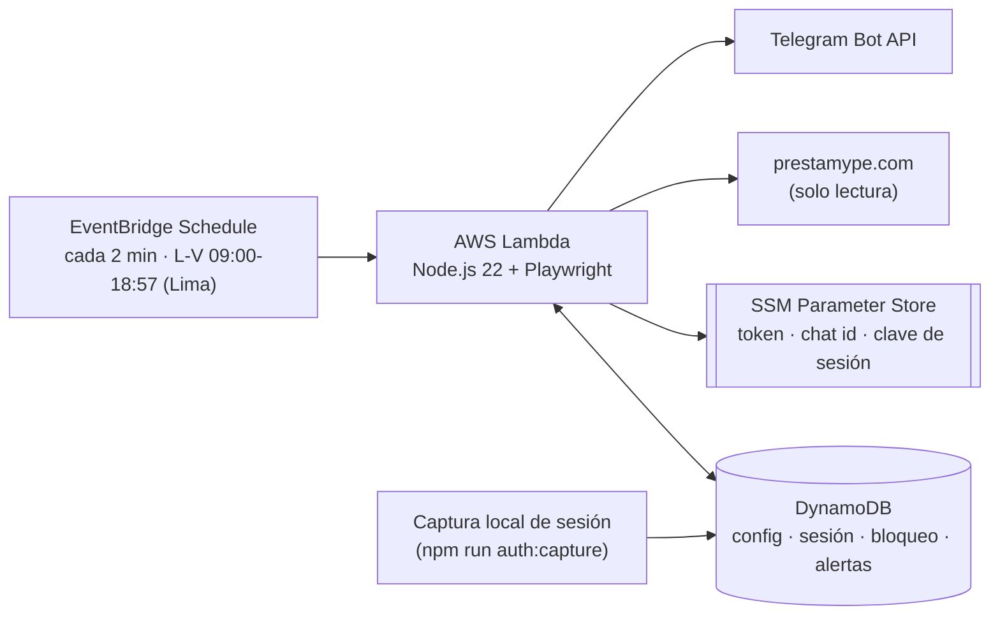

# Prestamype Monitor

Monitor de solo lectura para oportunidades de factoring en [Prestamype](https://www.prestamype.com), construido para Node.js 22 y desplegado como una función AWS Lambda programada. Lee la cartera y las oportunidades del inversionista, evalúa reglas locales sobre riesgo, retorno e historial, y envía una recomendación por Telegram cuando encuentra algo interesante.

> [!WARNING]
> Este proyecto **no invierte, reserva, oferta, transfiere dinero ni ejecuta ninguna acción financiera**. Solo observa y notifica. No resuelve ni evade CAPTCHA, y se detiene ante cualquier bloqueo o desafío de sesión para que la intervención sea siempre manual.

## Contenido

- [Cómo funciona](#cómo-funciona)
- [Requisitos previos](#requisitos-previos)
- [Instalación y comprobaciones locales](#instalación-y-comprobaciones-locales)
- [Sesión autenticada](#sesión-autenticada)
- [Dry-run](#dry-run)
- [Despliegue en AWS](#despliegue-en-aws)
- [Operación](#operación)
- [Estructura del proyecto](#estructura-del-proyecto)
- [Límites de seguridad](#límites-de-seguridad)
- [Documentación adicional](#documentación-adicional)

## Cómo funciona

Una regla de EventBridge invoca la función Lambda cada 2 minutos, de lunes a viernes, de 09:00 a 18:57 hora de Lima (14:00–23:57 UTC; Perú no tiene horario de verano). Cada invocación adquiere un bloqueo condicional en DynamoDB, comprueba que el monitor esté habilitado y dentro de su presupuesto mensual, descifra la sesión guardada, abre Chromium con Playwright en una sola pestaña, revisa oportunidades ordenadas por **Retorno mayor** y solo evalúa candidatos nuevos o modificados. Las recomendaciones se envían por Telegram y las decisiones se guardan de forma idempotente para no duplicar alertas.



Activar o desactivar el monitor solo cambia un indicador `enabled` en DynamoDB: la regla de EventBridge sigue disparándose en su propio horario y cada invocación decide si hay algo que hacer, así que no hay ninguna cola ni cadena de mensajes que reconstruir.

## Requisitos previos

- Node.js 22 (el proyecto fija `engines.node` en `>=22 <23`).
- PowerShell para los scripts operativos en `scripts/*.ps1`.
- Para desplegar: AWS CLI y AWS SAM CLI, con una identidad propia de privilegios mínimos (sin claves raíz) autenticada en la cuenta de destino.

## Instalación y comprobaciones locales

```powershell
npm ci
npm test
npm run typecheck
npm run lint
npm run format:check
```

Estos comandos no crean ni tocan recursos de AWS. El origen canónico de la aplicación es `https://www.prestamype.com`; el apex `https://prestamype.com` solo se admite como documento inicial de redirección. No se permiten otros subdominios ni recursos de terceros.

## Sesión autenticada

La autenticación se realiza manualmente en un navegador visible; la herramienta nunca solicita ni almacena la contraseña.

```powershell
$env:TABLE_NAME = "prestamype-monitor"
$env:SESSION_KEY_PARAMETER = "/prestamype/monitor/session-key"
npm run auth:capture
```

Por defecto `auth:capture` usa el adaptador AWS incluido: lee la clave de sesión (32 bytes en Base64) desde Parameter Store, cifra el estado con AES-256-GCM y lo guarda en DynamoDB. Inicia sesión con AWS con credenciales que puedan leer ese parámetro y escribir la tabla antes de ejecutarlo. Se abrirá Chromium de forma visible: inicia sesión tú mismo, completa cualquier verificación legítima y espera a que carguen las oportunidades. Si Chromium no puede iniciarse, instala el navegador de Playwright con `npx playwright install chromium`.

Para un adaptador local alternativo, exporta `createCaptureDependencies` y actívalo con `PRESTAMYPE_CAPTURE_ADAPTER`:

```powershell
$env:PRESTAMYPE_CAPTURE_ADAPTER = "./capture-adapter.js"
npm run auth:capture
```

> [!IMPORTANT]
> No copies cookies, contraseñas, tokens ni claves al terminal, al repositorio ni a registros. El estado de sesión siempre se guarda cifrado.

## Dry-run

### Con fixtures (modo seguro por defecto)

```powershell
npm run dry-run -- --fixture
```

Usa únicamente los fixtures sanitizados de `tests/fixtures`, valida con `lstat` y `realpath` que nada escape de esa raíz, no carga adaptadores y no accede a la red. Produce un resumen estable de decisión, score, riesgo, retorno, monto e identificador sanitizado.

### Con la cuenta real

El acceso real nunca es implícito: requiere `--live` y un adaptador indicado por `PRESTAMYPE_DRY_RUN_ADAPTER` (rutas locales `file:`, `data:`, `node:` o specifiers de paquete; se rechazan URL de red, UNC y cualquier `file:` con autoridad u hostname).

```powershell
npm run dry-run -- --live
```

El modo live descifra la sesión en memoria, abre un cliente Prestamype de solo lectura, consulta cartera y oportunidades, y muestra mensajes prospectivos prefijados con `[NO ENVIADO]`. No escribe datos ni reclama alertas, y siempre intenta cerrar el navegador y abortar de forma segura al vencer el plazo compartido entre cartera y oportunidades.

## Despliegue en AWS

La infraestructura se define en [`template.yaml`](template.yaml) (SAM): una tabla DynamoDB, la función Lambda de escaneo con su capa de Playwright/Chromium (`layers/browser`), el rol IAM y el grupo de logs. El despliegue inicial deja el monitor **deshabilitado**; activarlo es un paso explícito y posterior.

```powershell
sam build --use-container
sam deploy --stack-name prestamype-monitor --resolve-s3 --region sa-east-1 --capabilities CAPABILITY_IAM --no-confirm-changeset --no-fail-on-empty-changeset
```

La capa de navegador pesa cerca de 71 MiB comprimida, por encima del límite de carga directa de Lambda (50 MiB): SAM la sube y resuelve vía S3/CloudFormation, no uses `--zip-file`. Sigue el orden completo — cuenta AWS, presupuesto, parámetros SSM, blacklist inicial, sesión — descrito en [`docs/runbook.md`](docs/runbook.md) antes de desplegar en una cuenta nueva.

## Operación

Los scripts de `scripts/` envuelven las operaciones sensibles con confirmaciones explícitas y `-ValidateOnly` para probarlos sin tocar AWS:

| Script | Qué hace |
|---|---|
| `activate-monitor.ps1` | Exige escribir `ACTIVAR` y pone `enabled=true`; la regla de EventBridge ya estaba corriendo. |
| `deactivate-monitor.ps1` | Pone `enabled=false` sin borrar ningún dato. |
| `invoke-once.ps1` | Invoca un único escaneo directo sin activar el monitor. |
| `status-monitor.ps1` | Muestra estado, filtros configurados y el próximo escaneo en hora de Lima. |
| `resume-monitor.ps1` | Exige escribir `REANUDAR`; retira una pausa manual por sesión vencida, desafío de sesión o cambio de estructura ya corregido — nunca por coste o límite de tasa. |
| `bootstrap-parameters.ps1` | Crea/repara la configuración `CONFIG/MONITOR` y sobrescribe los parámetros SSM de token, chat y clave. |
| `seed-blacklist.ps1` | Inserta la blacklist inicial de forma idempotente, sin eliminar entradas existentes. |
| `configure-monitor.ps1` | Actualiza riesgos permitidos, monedas, retorno mínimo o inversión mínima. |

Consulta [`docs/OPERACION.md`](docs/OPERACION.md) para los comandos frecuentes del día a día y [`docs/runbook.md`](docs/runbook.md) para el procedimiento completo de despliegue, incidentes, diagnóstico y desmontaje.

```powershell
npm run telegram:test
npm run telegram:list-chats
```

## Estructura del proyecto

```
src/
  domain/         Reglas de negocio puras: scoring, blacklist, normalización, tipos
  application/     Orquestación del monitor (casos de uso, puertos)
  adapters/         DynamoDB y Parameter Store
  browser/         Cliente Playwright y parsers del DOM de Prestamype
  lambda/           Handler de la función programada
  cli/              auth:capture, dry-run y captura de DOM para fixtures
  notifications/    Cliente y formato de mensajes de Telegram
  security/         Redacción de datos sensibles y cifrado de sesión
  runtime/          Contenedor Lambda, guarda de costes y errores
tests/              Pruebas unitarias e infraestructura (mismo árbol que src/)
scripts/            Operación (PowerShell) y utilidades de Telegram/fixtures (Node)
layers/browser/     Dependencias de la capa Lambda (Playwright + Chromium)
docs/               Runbook, operación y specs de diseño
template.yaml        Infraestructura AWS (SAM)
```

## Límites de seguridad

- La salida usa una lista permitida de campos financieros y sanitiza antes y después del formateo: redacta RUC de 11 dígitos, cabeceras de autorización/cookies, credenciales Basic/Bearer, JWT, tokens, contraseñas, claves API y sesiones, además de controles y límites de tamaño. No se puede prometer la detección de cualquier secreto sin forma reconocible; no introduzcas secretos en nombres, razones, fixtures ni configuración visible.
- Los errores externos se convierten en mensajes genéricos; nunca se imprime la excepción original.
- El proyecto no resuelve ni evade CAPTCHA. Ante un desafío, expiración o bloqueo, se detiene y requiere intervención manual.
- Las recomendaciones son informativas y no sustituyen la decisión del usuario; no existe código para invertir.
- Solo se usan páginas visibles y navegación conservadora; no se consumen endpoints privados obtenidos por ingeniería inversa.
- La política de recursos permite documentos, scripts y solicitudes de aplicación únicamente desde `https://www.prestamype.com`, más el documento inicial del apex para su redirección. Imágenes, fuentes, media, terceros y cualquier subdominio distinto de `www` se bloquean.
- El plazo total por escaneo y el refresco periódico de detalle (15 minutos por defecto, configurable) son límites conservadores, no garantías de disponibilidad. Un timeout, CAPTCHA, cambio de DOM, 403 o 429 detiene la recomendación; no hay reintentos rápidos ni fallback a selectores genéricos.
- Una guarda de costes mensual (`costLimits` en DynamoDB) pausa el monitor si el consumo de GB-segundos se acerca al límite configurado.

Para desarrollar, usa `npm run test:watch`. Los fixtures deben permanecer ficticios y sanitizados.

## Documentación adicional

- [`docs/OPERACION.md`](docs/OPERACION.md) — comandos frecuentes del día a día.
- [`docs/runbook.md`](docs/runbook.md) — preparación de cuenta, despliegue, incidentes, diagnóstico y desmontaje completo.
- [`docs/superpowers/specs/2026-08-26-prestamype-monitor-design.md`](docs/superpowers/specs/2026-08-26-prestamype-monitor-design.md) — diseño original de filtros, puntuación y estrategia de navegación.
