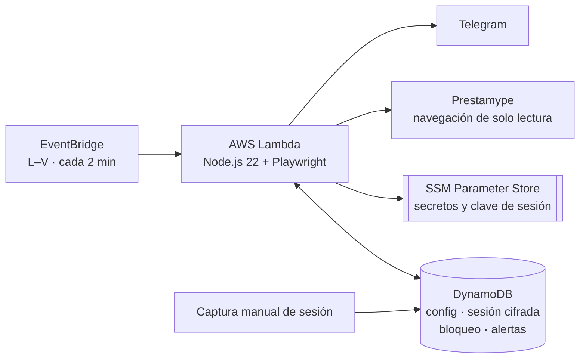

<div align="center">

# Prestamype Monitor

**Monitor experimental y de solo lectura para oportunidades de factoring.**

[](#-estado-del-proyecto)
[](#requisitos)
[](LICENSE)
[](#seguridad-y-l%C3%ADmites)

[Cómo funciona](#-cómo-funciona) · [Inicio local](#-inicio-local) · [AWS y costes](#-aws-y-control-de-costes) · [Operación](#-operación) · [Documentación](#-documentación)

</div>

> [!WARNING]
> El monitor **solo observa y notifica**. No invierte, reserva, oferta, transfiere dinero ni ejecuta acciones financieras. No resuelve ni evade CAPTCHA; ante desafíos o bloqueos, requiere intervención manual.
>
> Proyecto experimental e independiente. No está afiliado, respaldado ni patrocinado por Prestamype.

## 📌 Contenido

- [Qué hace](#-qué-hace)
- [Cómo funciona](#-cómo-funciona)
- [Requisitos](#-requisitos)
- [Inicio local](#-inicio-local)
- [Sesión autenticada](#-sesión-autenticada)
- [Dry-run](#-dry-run)
- [Despliegue en AWS](#-despliegue-en-aws)
- [AWS y control de costes](#-aws-y-control-de-costes)
- [Operación](#-operación)
- [Seguridad y límites](#-seguridad-y-límites)
- [Estructura](#-estructura-del-proyecto)
- [Contribuir](#-contribuir)
- [Documentación](#-documentación)
- [Licencia](#-licencia)

## ✨ Qué hace

- Lee cartera y oportunidades desde páginas visibles de Prestamype.
- Evalúa localmente reglas de riesgo, retorno e historial.
- Envía recomendaciones por Telegram y guarda decisiones para evitar alertas duplicadas.
- Ejecuta escaneos programados en AWS, con pausas ante problemas de sesión, límites de tasa o coste.
- Permite probar decisiones con fixtures sanitizados sin acceder a la red.

## ⚙️ Cómo funciona

De lunes a viernes, EventBridge programa un escaneo cada 2 minutos entre las 09:00 y las 18:57, hora de Lima. Lambda adquiere un bloqueo en DynamoDB, valida que el monitor esté habilitado y dentro de sus límites, consulta las páginas permitidas, evalúa oportunidades nuevas o modificadas y envía las alertas por Telegram.


```mermaid
flowchart LR
    EB["EventBridge<br/>L–V · cada 2 min"] --> L["AWS Lambda<br/>Node.js 22 + Playwright"]
    L <--> D[("DynamoDB<br/>config · sesión cifrada<br/>bloqueo · alertas")]
    L --> SSM[["SSM Parameter Store<br/>secretos y clave de sesión"]]
    L --> PM["Prestamype<br/>navegación de solo lectura"]
    L --> TG["Telegram"]
    CAP["Captura manual de sesión"] --> D
```

Activar o pausar el monitor solo cambia `enabled` en DynamoDB. El horario de EventBridge permanece configurado y cada invocación decide si debe procesar un escaneo.

Los detalles de una oportunidad se vuelven a consultar cuando cambia la tarjeta visible y, de forma conservadora, cuando vence el refresco periódico (15 minutos por defecto). Así se pueden detectar cambios de historial, fechas, cobranza o score aunque la tarjeta no haya cambiado.

## 🧰 Requisitos

- Node.js 22 (`engines.node`: `>=22 <23`) y npm.
- PowerShell para los scripts operativos.
- Para capturar una sesión local: Chromium compatible con Playwright.
- Para desplegar: AWS CLI, AWS SAM CLI y una identidad AWS de privilegios mínimos. No uses credenciales de la cuenta raíz.

## 🚀 Inicio local

Instala dependencias y ejecuta las comprobaciones locales:

```powershell
npm ci
npm test
npm run typecheck
npm run lint
npm run format:check
```

Estos comandos no crean ni modifican recursos AWS. Para un primer recorrido seguro, usa el modo de fixtures:

```powershell
npm run dry-run -- --fixture
```

El origen canónico de la aplicación es `https://www.prestamype.com`. El dominio apex solo se acepta como documento inicial para redirigir a `www`; no se permiten otros subdominios ni recursos de terceros.

## 🔐 Sesión autenticada

La autenticación se completa manualmente en un navegador visible. La herramienta no pide ni almacena tu contraseña. El adaptador AWS cifra el estado de sesión con AES-256-GCM antes de guardarlo en DynamoDB.

```powershell
$env:TABLE_NAME = "prestamype-monitor"
$env:SESSION_KEY_PARAMETER = "/prestamype/monitor/session-key"
npm run auth:capture
```

Inicia sesión en la ventana de Chromium y completa tú mismo cualquier verificación legítima. Si falta el navegador local, instala Chromium para Playwright con `npx playwright install chromium`.

Para un adaptador de captura local alternativo, configura `PRESTAMYPE_CAPTURE_ADAPTER` con un módulo que exporte `createCaptureDependencies`:

```powershell
$env:PRESTAMYPE_CAPTURE_ADAPTER = "./capture-adapter.js"
npm run auth:capture
```

> [!CAUTION]
> No pegues ni guardes contraseñas, cookies, tokens, claves o credenciales AWS en el repositorio, argumentos de comandos, capturas o logs. No exportes cookies a archivos. Consulta el [runbook](docs/runbook.md) antes de operar en AWS.

## 🧪 Dry-run

### Fixtures — modo local seguro

```powershell
npm run dry-run -- --fixture
```

Usa únicamente fixtures sanitizados de `tests/fixtures`, no carga adaptadores y no accede a la red. Comprueba que los archivos permanezcan dentro de la raíz permitida y genera un resumen de la decisión, score, riesgo, retorno, monto e identificador sanitizado.

### Cuenta real — solo lectura y explícito

El modo live no se activa por defecto. Requiere `--live` y un adaptador definido mediante `PRESTAMYPE_DRY_RUN_ADAPTER`:

```powershell
npm run dry-run -- --live
```

Consulta cartera y oportunidades con una sesión descifrada en memoria y muestra mensajes prospectivos con el prefijo `[NO ENVIADO]`. No envía notificaciones, no reclama alertas ni escribe datos. Solo admite adaptadores locales o de paquete; rechaza URL de red, UNC y URL `file:` con autoridad u hostname.

El adaptador definido en `PRESTAMYPE_DRY_RUN_ADAPTER` debe exportar una función asíncrona `createDryRunDependencies` que proporcione `store`, `key` y `launcher`; `config` y `blacklist` son opcionales. Las rutas locales absolutas o relativas se convierten a URL `file:` desde el directorio actual. Se aceptan specifiers `file:`, `data:`, `node:` y de paquete; se rechazan `http:`, `https:`, rutas UNC y URL `file:` con hostname o autoridad. El módulo live debe ser confiable, ya que se ejecuta en el proceso local.

## ☁️ Despliegue en AWS

La infraestructura se define en [`template.yaml`](template.yaml) y se despliega con AWS SAM. El despliegue inicial deja el monitor **deshabilitado**; la activación es un paso independiente y explícito.

```powershell
sam build --use-container
sam deploy --stack-name prestamype-monitor --resolve-s3 --region sa-east-1 --capabilities CAPABILITY_IAM --no-confirm-changeset --no-fail-on-empty-changeset
```

La capa de Chromium/Playwright supera el límite de 50 MiB para cargas ZIP directas de Lambda. Usa SAM con S3/CloudFormation; no publiques la capa con `--zip-file`. En una cuenta nueva, sigue el [runbook de despliegue](docs/runbook.md) antes de desplegar: incluye preparación de cuenta, presupuesto, parámetros SSM, blacklist y sesión.

## 💸 AWS y control de costes

Desplegar y operar recursos AWS puede generar cargos. El gasto depende de la región, la frecuencia de escaneo, las invocaciones y duración de Lambda, DynamoDB, almacenamiento y solicitudes de CloudWatch, Parameter Store y S3. No se promete un coste mensual fijo.

Antes del despliegue:

1. Crea un **AWS Budget mensual** para la región/cuenta, con un límite que puedas asumir y correo verificado.
2. Configura alertas anticipadas —por ejemplo, al 50 %, 80 % y 100 % del límite— y revisa regularmente el consumo real. Ajusta los umbrales a tu uso.
3. Recuerda que AWS Budgets **notifica; no detiene automáticamente el gasto**.
4. Revisa retención de logs y el ciclo de vida del bucket de artefactos SAM.
5. Mantén el monitor deshabilitado mientras validas el despliegue. Paúsalo si detectas gasto o actividad inesperados.

Además del AWS Budget, el monitor tiene una guarda operativa por consumo mensual de Lambda en GB-segundos (`costLimits` en DynamoDB), que puede pausar los escaneos al acercarse a su límite configurado. Esa guarda complementa el presupuesto y no sustituye la revisión de los cargos de todos los servicios. El [runbook](docs/runbook.md) explica supervisión, pausas y desmontaje.

## 🛠️ Operación

Los scripts sensibles tienen `-ValidateOnly` para validar parámetros sin ejecutar la acción remota. Ejecútalos desde PowerShell en la raíz del repositorio.

| Script | Función |
|---|---|
| `scripts/activate-monitor.ps1` | Pide escribir `ACTIVAR` y habilita el monitor. |
| `scripts/deactivate-monitor.ps1` | Pausa el monitor sin borrar datos. |
| `scripts/invoke-once.ps1` | Ejecuta un escaneo único sin habilitar el ciclo continuo. |
| `scripts/status-monitor.ps1` | Muestra estado, filtros y próximo escaneo en hora de Lima. |
| `scripts/resume-monitor.ps1` | Reanuda una pausa manual recuperable; no desbloquea pausas por coste ni rate limit. |
| `scripts/bootstrap-parameters.ps1` | Prepara configuración y parámetros SSM secretos. |
| `scripts/seed-blacklist.ps1` | Inserta la blacklist inicial de forma idempotente. |
| `scripts/configure-monitor.ps1` | Cambia filtros de riesgo, monedas, retorno e inversión mínima. |

Comandos útiles de Telegram:

```powershell
npm run telegram:test
npm run telegram:list-chats
```

Para los pasos operativos, comandos y recuperación de incidentes, consulta [`docs/OPERACION.md`](docs/OPERACION.md), [`docs/telegram-commands.md`](docs/telegram-commands.md), [`scripts/README.md`](scripts/README.md) y el [runbook](docs/runbook.md).

## 🛡️ Seguridad y límites

- El monitor es informativo: no invierte ni reemplaza la evaluación personal.
- La navegación es visible y conservadora; no usa endpoints privados obtenidos por ingeniería inversa.
- No resuelve ni evade CAPTCHA. Ante desafíos, sesión vencida, bloqueo o rate limit, detiene el proceso y requiere intervención o espera manual.
- Solo admite documentos, scripts y solicitudes de aplicación de `www.prestamype.com`, además del documento inicial del apex para redirigir. Bloquea medios, fuentes, terceros y otros subdominios.
- La salida usa campos permitidos y sanitiza datos sensibles conocidos, como RUC, credenciales, cookies, tokens, claves API y sesiones. Ningún filtro puede detectar todos los secretos posibles: no los pongas en campos visibles, fixtures ni configuración.
- Los errores externos se convierten en mensajes genéricos. Los logs no deben incluir secretos, HTML privado ni registros completos de DynamoDB.
- Los límites de tiempo y refresco son conservadores, no garantías de disponibilidad. Un timeout, cambio del DOM, HTTP 403 o 429 detiene la recomendación; no hay reintentos rápidos ni selectores genéricos de respaldo.

## 🗂️ Estructura del proyecto

```text
src/
  domain/          Reglas de negocio: scoring, blacklist, normalización y tipos
  application/     Casos de uso y puertos del monitor
  adapters/        DynamoDB y Parameter Store
  browser/         Cliente Playwright y parsers
  lambda/          Handler programado
  cli/             Captura de sesión, dry-run y captura de DOM
  notifications/   Telegram y formato de mensajes
  security/        Redacción de datos y cifrado de sesión
  runtime/         Guarda de costes, contenedor y errores
scripts/           Operación AWS, Telegram y fixtures
layers/browser/    Playwright y Chromium para Lambda
tests/              Pruebas unitarias e infraestructura
docs/               Runbook, operación y comandos de Telegram
template.yaml       Infraestructura AWS SAM
```

## 🤝 Contribuir

Se agradecen correcciones, mejoras de seguridad y cambios acompañados de pruebas. Mantén los fixtures ficticios y sanitizados; no incluyas credenciales, sesiones, información personal ni datos financieros reales. Los cambios deben respetar el modo de solo lectura y no automatizar ofertas, inversiones, transferencias ni evasión de CAPTCHA.

### Contribuidores

<a href="https://github.com/maishet/prestamype-monitor/graphs/contributors">
  
</a>

Las contribuciones aparecen automáticamente cuando GitHub actualiza el historial público del repositorio. [Ver contribuidores en GitHub](https://github.com/maishet/prestamype-monitor/graphs/contributors).

## 📚 Documentación

- [Runbook AWS](docs/runbook.md) — despliegue, sesiones, seguridad, costes, operación, incidentes y desmontaje.
- [Operación](docs/OPERACION.md) — comandos frecuentes y procedimientos del día a día.
- [Comandos de Telegram](docs/telegram-commands.md) — referencia de comandos administrativos.
- [Scripts](scripts/README.md) — uso de utilidades y parámetros.

## 📄 Licencia

Este proyecto se distribuye bajo la [licencia ISC](LICENSE). Las marcas Prestamype y de otros terceros pertenecen a sus respectivos titulares.

## 🧭 Estado del proyecto

**Experimental.** Las páginas de Prestamype pueden cambiar y los recursos AWS pueden generar costes. Revisa los logs sanitizados y el presupuesto, conserva la activación bajo control humano y consulta el runbook antes de operar.
