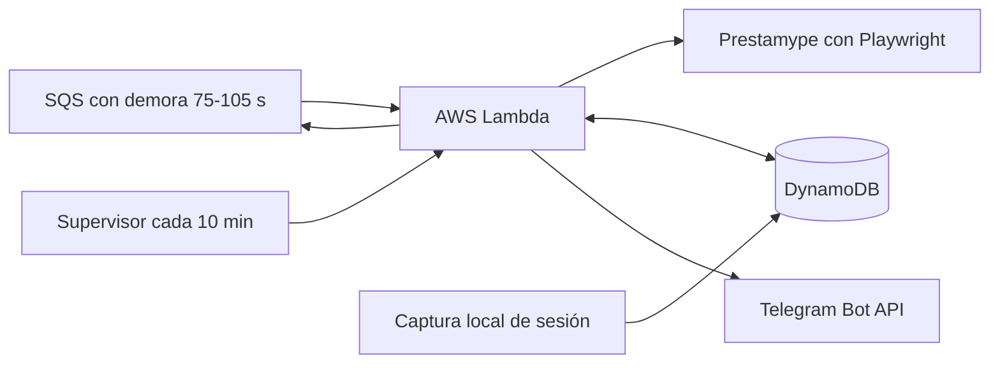

# Diseño del monitor de oportunidades de Prestamype

**Fecha:** 26 de agosto de 2026  
**Estado:** Arquitectura y estrategia aprobadas por el usuario; documento pendiente de revisión final  
**Plataforma objetivo:** AWS Lambda, Amazon SQS, EventBridge Scheduler, DynamoDB y Telegram  
**Región inicial:** `sa-east-1` (São Paulo)  

## 1. Objetivo

Construir un monitor de solo lectura que revise continuamente las oportunidades de factoring de la cuenta del usuario en Prestamype, evalúe cada subasta según su estrategia histórica y envíe por Telegram una recomendación clara cuando encuentre una oportunidad atractiva.

El monitor debe funcionar sin depender de la computadora del usuario, aspirar a un costo mensual de USD 0 dentro de los niveles gratuitos de AWS y minimizar el riesgo de bloqueo de la cuenta mediante una frecuencia conservadora, una sola sesión y detención automática ante controles del sitio.

## 2. Alcance y exclusiones

### Incluido

- Acceso autenticado de solo lectura a la página de oportunidades.
- Ordenamiento por **Retorno mayor**.
- Evaluación de riesgos A+, A, B y C. A+ se incluye por ser un riesgo mejor que A; se agrupa con A para la puntuación.
- Retorno anual mínimo de 15%.
- Análisis del historial del pagador/deudor y del proveedor.
- Consulta del estado de la cartera para detectar problemas de cobranza.
- Lista negra con prioridad absoluta.
- Puntuación explicable y recomendación por Telegram.
- Avisos de sesión vencida, CAPTCHA, bloqueos, errores y detención por presupuesto.
- Persistencia de oportunidades ya analizadas para evitar alertas duplicadas.

### Excluido

- Invertir, reservar, ofertar o transferir dinero automáticamente.
- Guardar o reutilizar la contraseña de Prestamype.
- Resolver o eludir CAPTCHA.
- Evadir bloqueos, limitaciones o controles de Prestamype.
- Consultar endpoints privados obtenidos mediante ingeniería inversa.
- Garantizar rentabilidad, ausencia de mora, costo cero o ausencia total de riesgo de bloqueo.

## 3. Estrategia del usuario observada

Los reportes entregados y la revisión de la cuenta muestran una estrategia orientada a retornos altos, con tolerancia a concentraciones elevadas cuando el historial de pago respalda la oportunidad. El filtro principal indicado por el usuario es un retorno anual mayor o igual a 15%, seguido por la revisión del riesgo y del historial de subastas pagadas.

El sistema no impondrá un límite duro de concentración. Mostrará la concentración resultante como información y la incorporará con un peso pequeño en la puntuación.

Estado observado durante el diseño:

- Saldo disponible: S/0.
- SUPERDEPORTE/MARATHON: S/6,807.52, riesgo B, 18.16% anual.
- AIG S.A.C.: S/3,157.05, riesgo C, 16.08% anual.
- CORPORACIÓN LERIBE S.A.C.: S/720.76, riesgo C, 18.16% anual, en Cobranza administrativa I.

Estos valores son contexto del diseño y no se codificarán como saldos permanentes. El monitor leerá los valores vigentes cuando la sesión y la página lo permitan.

## 4. Arquitectura

### 4.1 Ejecución principal

1. Un mensaje demorado de Amazon SQS invoca Lambda.
2. Lambda publica al inicio el siguiente mensaje con `DelaySeconds` aleatorio entre 75 y 105 segundos.
3. Lambda adquiere un bloqueo condicional en DynamoDB para impedir ejecuciones simultáneas.
4. Recupera y descifra el estado de sesión.
5. Abre Chromium con Playwright, una sola pestaña y un perfil constante.
6. Visita oportunidades, aplica **Retorno mayor** y analiza únicamente los candidatos necesarios.
7. Evalúa candidatos nuevos o materialmente modificados.
8. Envía las alertas pertinentes y guarda resultados idempotentes.
9. Cierra el navegador y libera el bloqueo.

Publicar primero la siguiente ejecución evita que un error posterior rompa la cadena. SQS ofrece entrega al menos una vez; el bloqueo y la idempotencia absorben posibles duplicados. Un supervisor de EventBridge cada diez minutos revisará la marca `next_scan_at` y reconstruirá la cadena si queda atrasada. EventBridge se limita a esta supervisión porque sus programaciones tienen precisión de un minuto, mientras que SQS permite demoras individuales en segundos sin mantener Lambda esperando.

### 4.2 Servicios AWS

- **AWS Lambda:** Node.js, 1 GB inicial de memoria, una ejecución concurrente y tiempo máximo de 30 segundos.
- **Amazon SQS:** cola estándar con mensajes demorados para encadenar revisiones cada 75–105 segundos.
- **EventBridge Scheduler:** supervisor recurrente cada diez minutos.
- **DynamoDB:** configuración, sesión cifrada, bloqueo, oportunidades, alertas, lista negra y contadores.
- **Systems Manager Parameter Store:** token de Telegram, identificadores y clave de cifrado como parámetros estándar protegidos.
- **CloudWatch:** métricas y registros con retención corta, sin datos de sesión.

No se usará NAT, VPC privada, IP fija, Secrets Manager, base de datos externa ni un contenedor permanente porque añadirían costo o complejidad innecesaria.

## 5. Sesión y autenticación

- Una herramienta local abrirá Prestamype para que el usuario inicie sesión manualmente.
- La herramienta capturará únicamente el estado de sesión generado por el navegador; nunca la contraseña.
- El estado se cifrará con AES-256-GCM antes de almacenarse en DynamoDB.
- La clave de cifrado y el token de Telegram estarán fuera del repositorio.
- Los permisos IAM permitirán que solo la función del monitor lea los parámetros y el registro de sesión.
- Los registros nunca mostrarán cookies, tokens, cabeceras de autenticación ni el contenido descifrado.
- Cuando la sesión venza o aparezca CAPTCHA, el monitor se pausará y Telegram solicitará una nueva autenticación manual.

## 6. Navegación conservadora

- Una sola sesión, función, pestaña y solicitud de navegación a la vez.
- Intervalo normal aleatorio de 75–105 segundos, promedio aproximado de 90 segundos.
- Se bloquearán imágenes, video, audio, fuentes, publicidad y analítica cuando no sean necesarios para el DOM.
- Se usarán cookies, zona horaria `America/Lima`, idioma español y una huella de navegador consistente.
- La primera página se ordenará por **Retorno mayor**.
- Se dejará de recorrer la lista cuando el retorno caiga por debajo de 15% y el orden sea verificable.
- Los detalles se abrirán solamente para oportunidades nuevas, modificadas o candidatas a alerta.
- No habrá refrescos paralelos ni reintentos rápidos.
- Los selectores dependerán de contenido visible y tendrán alternativas controladas; no se consumirán endpoints internos no documentados.

### Circuito de protección de cuenta

- Ante un CAPTCHA o sesión vencida: pausa indefinida hasta reautenticación manual.
- Ante HTTP 403 o 429: cerrar el navegador, avisar y pausar inicialmente 6 horas.
- Segunda incidencia consecutiva: pausa de 24 horas.
- Tercera incidencia consecutiva: desactivación hasta revisión manual.
- Ante cambios importantes del DOM: no inferir datos; enviar diagnóstico y pausar recomendaciones.

## 7. Filtros y puntuación

### 7.1 Reglas obligatorias

Una oportunidad solo puede recomendarse si:

1. El riesgo es A+, A, B o C.
2. El retorno anual es mayor o igual a 15%.
3. El monto restante permite al menos la inversión mínima aplicable.
4. La moneda es PEN, salvo que el usuario habilite USD posteriormente.
5. Ningún participante coincide con la lista negra.
6. No existe una señal actual de cobranza problemática asociada al proveedor o pagador.
7. Los datos esenciales —empresa, retorno, riesgo e identificador— pudieron verificarse.

No tener una historia extensa no ocasiona necesariamente un rechazo, pero reduce la puntuación y se muestra como advertencia.

### 7.2 Puntuación sobre 100

| Componente | Peso | Criterios principales |
|---|---:|---|
| Historial del pagador/deudor | 30 | Morosidad, proporción pagada sin retraso, retraso promedio y casos vencidos |
| Historial del proveedor | 20 | Pagos sin retraso, retrasos y número de operaciones |
| Experiencia y volumen | 15 | Número de subastas y monto histórico observado |
| Retorno anual | 15 | 15% obtiene puntuación básica; 20% o más obtiene el máximo |
| Clasificación de riesgo | 10 | A+/A: 10; B: 8; C: 6 |
| Plazo | 5 | Favorece plazos más cortos manteniendo el retorno |
| Concentración | 5 | Advertencia y ajuste menor; nunca bloqueo automático |

Reglas iniciales de interpretación:

- **80–100:** recomendación alta; Telegram inmediato.
- **70–79:** oportunidad para revisión; Telegram con advertencias.
- **Menos de 70:** guardar para trazabilidad, sin alerta ordinaria.
- **Lista negra o regla obligatoria fallida:** no invertir, independientemente del puntaje teórico.

La fórmula exacta se implementará como configuración versionada y se probará con los casos reales reunidos durante el diseño.

## 8. Lista negra y problemas de pago

La lista negra es una anulación absoluta de la puntuación.

Entrada inicial:

- Razón social: `CORPORACION LERIBE S.A.C.`
- RUC: `20517854523`
- Motivo: inversión observada en `Cobranza administrativa I`.

La comparación se hará por RUC cuando esté disponible y, como respaldo, por razón social normalizada sin acentos, puntuación ni diferencias de mayúsculas.

Cuando una inversión entre en cobranza administrativa, cobranza legal, vencimiento problemático u otro estado equivalente:

1. Se registrará la evidencia y la fecha.
2. Se bloquearán tanto el proveedor como el pagador identificados en esa inversión.
3. Se enviará un aviso explicando las nuevas entradas.
4. Las futuras oportunidades relacionadas se marcarán **NO INVERTIR**, aunque cumplan retorno, riesgo e historial.

Las entradas no desaparecerán automáticamente cuando se regularice un pago. Su eliminación requerirá una acción manual y quedará auditada.

## 9. Alertas de Telegram

Cada alerta incluirá:

- Prioridad y recomendación: **INVERTIR**, **REVISAR** o **NO INVERTIR**.
- Empresa, identificador y enlace directo.
- Riesgo, retorno anual y mensual si está disponible.
- Fecha de cierre y vencimiento.
- Monto total, financiado y restante.
- Historial del pagador y proveedor.
- Puntaje total y desglose resumido.
- Dos o tres razones favorables y todas las alertas relevantes.
- Concentración resultante si el saldo y cartera pueden leerse.
- Saldo disponible y monto posible; si es S/0, se indicará que no existe liquidez para participar.
- Hora de detección en Lima.

El término **INVERTIR** significa que la oportunidad satisface las reglas configuradas; no ejecuta ni reemplaza la decisión final del usuario.

Las alertas técnicas serán distintas de las financieras: sesión vencida, CAPTCHA, pausa por protección, error de estructura, presupuesto próximo al límite y recuperación del servicio.

## 10. Persistencia e idempotencia

DynamoDB empleará una tabla única con claves prefijadas:

- `CONFIG#MONITOR`
- `SESSION#PRESTAMYPE`
- `LOCK#SCANNER`
- `OPPORTUNITY#<id>`
- `ALERT#<opportunity-id>#<material-version>`
- `BLACKLIST#RUC#<ruc>`
- `BLACKLIST#NAME#<normalized-name>`
- `USAGE#<yyyy-mm>`

Una versión material cambiará cuando varíen retorno, riesgo, monto restante, fechas, estado o historial relevante. No se repetirá una alerta idéntica. Una mejora importante de puntuación o urgencia sí podrá generar una actualización.

## 11. Control de costo

Objetivo operativo: USD 0 al mes, sin prometerlo como garantía contractual.

Supuestos iniciales:

- Cerca de 28,800 revisiones mensuales a un promedio de 90 segundos.
- 1 GB de memoria por ejecución.
- Menos de 10–12 segundos por revisión normal.
- Una sola función concurrente.
- Almacenamiento mínimo en DynamoDB y parámetros estándar.
- Menos de 100,000 operaciones mensuales de SQS, frente a un nivel gratuito de un millón.

Protecciones:

- Medir duración, memoria, invocaciones y proyección de GB-segundos.
- Avisar al llegar al 70% y pausar el escaneo ordinario al 87.5% del nivel gratuito mensual estimado.
- Máximo inicial de 31,000 escaneos mensuales.
- Timeout de 30 segundos y aborto anticipado si Prestamype no responde.
- Registros concisos con retención de siete días.
- Presupuesto de AWS con alertas; no se confiará en el presupuesto como tope automático.
- Interruptor manual en DynamoDB para detener todo el monitor.

Antes de activar 24/7 habrá una fase de medición que comprobará memoria, duración, transferencia y estabilidad. Si 1 GB no resulta suficiente o las ejecuciones exceden el margen gratuito, se pausará y se presentará una nueva estimación antes de continuar.

## 12. Fallos y recuperación

- **Sesión vencida/CAPTCHA:** pausa y reautenticación local.
- **403/429:** escalamiento de pausas y circuito de protección.
- **Prestamype caído:** reintento limitado de EventBridge; sin alertas financieras parciales.
- **Cambio de interfaz:** capturar diagnóstico sin secretos, notificar y detener recomendaciones.
- **Telegram caído:** reintentos acotados; conservar alerta pendiente en DynamoDB.
- **Cadena de SQS rota:** supervisor la reconstruye si no hay una ejecución futura válida.
- **Dos Lambdas simultáneas:** bloqueo condicional; la segunda termina sin navegar.
- **Límite de costo próximo:** detener nuevas programaciones ordinarias y avisar.

## 13. Pruebas y criterios de aceptación

La implementación seguirá pruebas primero para la lógica determinista y adaptadores simulados para servicios externos.

Debe verificarse como mínimo:

- Inclusión de A+, A, B y C; exclusión del resto.
- Umbral anual de 15%, incluidos sus límites exactos.
- LERIBE siempre produce **NO INVERTIR** por RUC y por nombre normalizado.
- Una lista negra anula cualquier puntuación alta.
- Puntuación reproducible para historiales favorables, débiles y ausentes.
- No se duplica una alerta idéntica.
- Una oportunidad materialmente mejorada puede generar actualización.
- Saldo S/0 no oculta una buena oportunidad, pero evita sugerir un monto disponible.
- Bloqueo condicional impide navegación concurrente.
- CAPTCHA, 403 y 429 detienen la navegación según la política.
- La proyección de costo activa avisos y pausa.
- Los logs no contienen cookies, tokens ni estado descifrado.
- La cadena de SQS se recupera mediante el supervisor.
- Mensajes duplicados de SQS no producen navegaciones o alertas duplicadas.

La activación 24/7 requerirá una prueba controlada con la cuenta real, confirmación de recepción por Telegram y revisión de métricas tras varias horas y después de 24 horas.

## 14. Despliegue previsto

1. Crear el bot de Telegram y obtener el `chat_id` mediante interacción del usuario.
2. Crear la cuenta/proyecto AWS y activar alertas presupuestarias.
3. Desplegar infraestructura con código reproducible.
4. Ejecutar la captura local de sesión con inicio de sesión manual.
5. Ejecutar una revisión única en modo diagnóstico.
6. Verificar una alerta de prueba sin datos sensibles.
7. Activar el encadenamiento de SQS cada 75–105 segundos y el supervisor de EventBridge.
8. Observar métricas y consumo; mantener el interruptor de costo activo.

Las acciones de creación de cuenta, ingreso de credenciales, autenticación en Prestamype y configuración final de Telegram requerirán participación explícita del usuario. El sistema nunca realizará una inversión.

## 15. Decisiones futuras deliberadamente aplazadas

- Habilitar oportunidades en USD.
- Cambiar pesos o umbrales después de acumular resultados.
- Incorporar una IP saliente fija con costo.
- Migrar a Oracle Always Free o Railway si Lambda resulta incompatible con la sesión.
- Crear un panel web; Telegram y registros estructurados son suficientes para la primera versión.
